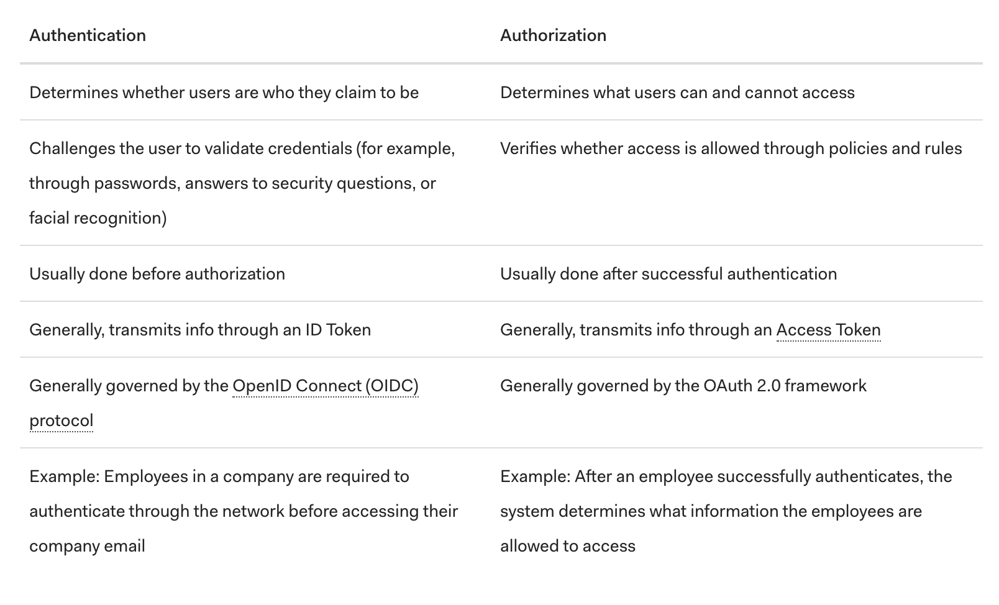

[Reference Article](https://www.csoonline.com/article/3216404/what-is-oauth-how-the-open-authorization-framework-works.html)

## Oauth 
 - allows websites and services to share assets among users
- widely accepted, but has vulnerabilities
- challenge is to provide a seamless, single sign-on [SSO](https://www.csoonline.com/article/2115776/what-is-sso-how-single-sign-on-improves-security-and-the-user-experience.html) access experience among multiple computers, each of which require unrelated logon accounts to access their services & content
- is responsible for two-factor authentication [2FA](https://www.csoonline.com/article/3239144/2fa-explained-how-to-enable-it-and-how-it-works.html) or multi-factor authentication (MFA) which allows the user to log onto one place and not have to put in another access credential 
- is more about authorization & not directly about authentication
    - **authentication:** process  of a user/subject proving its ownership of a presented identity by providing a password or or unique factor
    - **authorization:** process of letting a subject access resources after a successful authentication, usually somewhere else
- OAuth should be thought of as being about open AUTHiration
- OAUTH 2.0 is a framework, not a protocol

[Authentication and Authorization Flows](https://auth0.com/docs/flows)

