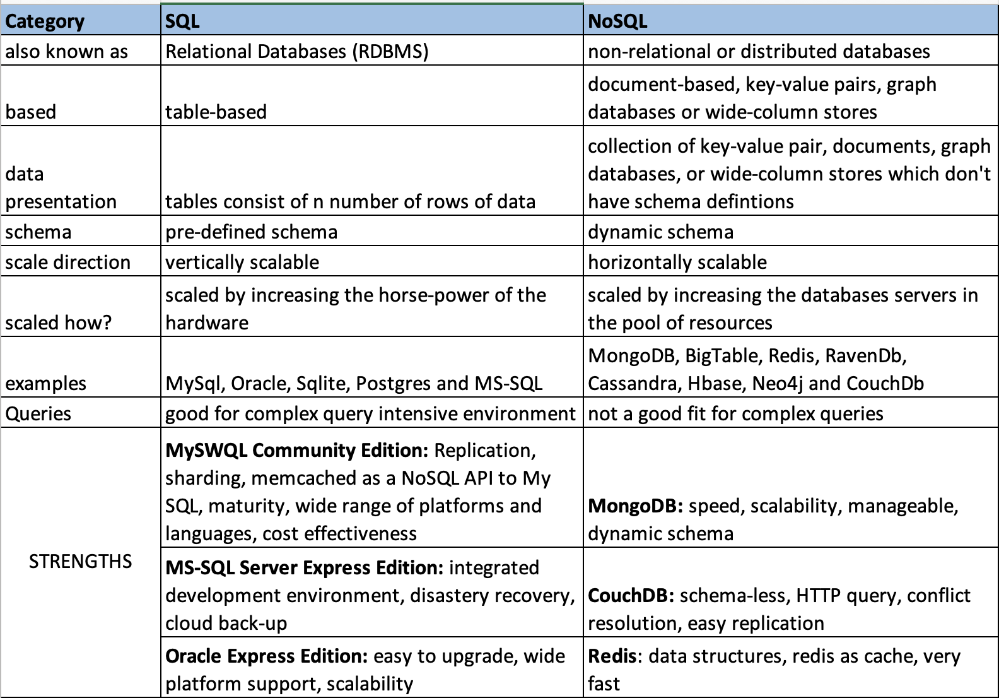

[Reference Article](https://www.thegeekstuff.com/2014/01/sql-vs-nosql-db/?utm_source=tuicool)

## SQL Vs NoSQL Databases

[NoSQL Data Modeling Techniques](https://highlyscalable.wordpress.com/2012/03/01/nosql-data-modeling-techniques/)

## Conceptual Techniques
1. Denormalization
1. Aggregates
1. Application Side Joins
1. Atomic Aggregates
1. Enumberable Keys
1. Dimensionality Reduction
1. Index Table
1. Composite Key Index
1. Aggregation w/ Composite Keys
1. Inverted Search - Direct Aggregation
