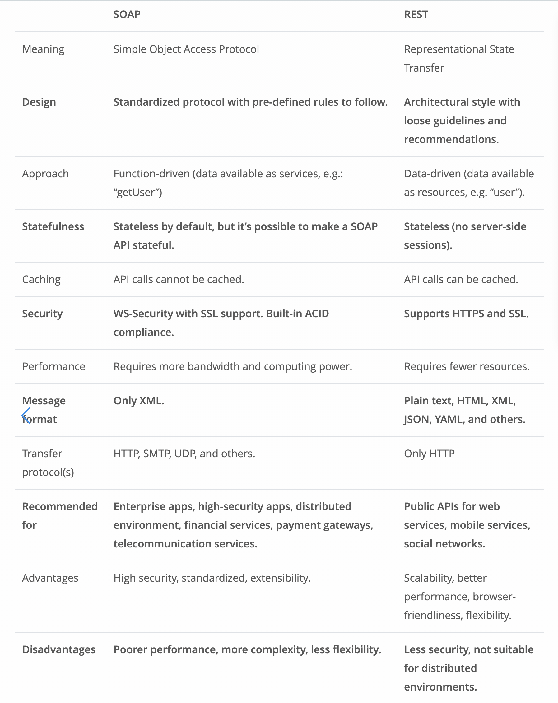

# Readings

**1. What’s the difference between PUT and PATCH?**
The differences have to do with the way the server processes the enclosed entity to modify the resource identified by the request-URI.  A PUT request contains a modified version of the resource that's stored on the original server.  A PATCH request contains a set of instructions that describes how a resource that's on the origin server should be modiied to make a new version.

**1. Provide links to 3 services or tools that allow you to “mock” an API for development like json-server.**
    MockServer: https://www.mock-server.com/
    Beeceptor: https://beeceptor.com/
    Mockoon: https://mockoon.com/

**1. Compare and contrast Swagger and APIDoc.js**
**apiDocjs:** 
- inline Documentation for RESTful web APIs. 
- creates a documentation from API annotations in your source code.
- includes a default template which uses handlebars, Bootstrap, RequireJS and jQuery for the output of the generated apidata.js and apiproject.js as a html-page; 

**Swagger Inspector:** 
- test and Document APIs 
- free cloud-based API testing and documentation tool to simplify the validation of any API and generate its corresponding OpenAPI documentation.

- apiDocjs and Swagger Inspector can be primarily classified as "API" tools.

**1. Which HTTP status codes should be sent with each type of (un)successful API call?**
1xx: Informational
2xx: Success
3xx: Redirection
4xx: Client Error
5xx: Server Error

[HTTP Status Codes](https://restfulapi.net/http-status-codes/)

**1. Compare and contrast SOAP and ReST.**
**SOAP** = Simple Object Access Protocol
**REST** = Representation State Transfer

- Both allow you to create your own API.
- SOAP is a protocol & REST is an architectural style
- REST allows different messaging formats (HTML, JSON, XML) & SOAP only allows XML
- REST is lightweight architecture so has better performance

Terms

- **Web Server** - computer software and underlying hardware that accepts requests via HTTP, the network protocol created to distribute web pages, or its secure variant HTTPS [wikipedia](https://en.wikipedia.org/wiki/Web_server)
- **Express** - backend web application for Node.js [wikipiedia](https://en.wikipedia.org/wiki/Express.js)
- **Routing** - process of selecting a path for traffic in a network or between multiple networks [wikipedia](https://en.wikipedia.org/wiki/Routing)
- **WRRC** - web request response cycle [link](https://medium.com/@jen_strong/the-request-response-cycle-of-the-web-1b7e206e9047)

## Preview

Which 3 things had you heard about previously and now have better clarity on?
- I had heard about asyncronous API's previously and now have an idea of how they're used and why
- what middleware is, its use, and how it operates in the BE
- how .splice works

Which 3 things are you hoping to learn more about in the upcoming lecture/demo?
- Express methods
- additional HTTP status codes
- Express events

What are you most excited about trying to implement or see how it works?
- using superagent methods like .pipe and .write
- asynchronous API's
- more of middleware's uses

## Bookmarks
- [nodeJS.docs]()
- [npm docs]()
- [express docs]()
- [http status codes]()
- [supertest]()