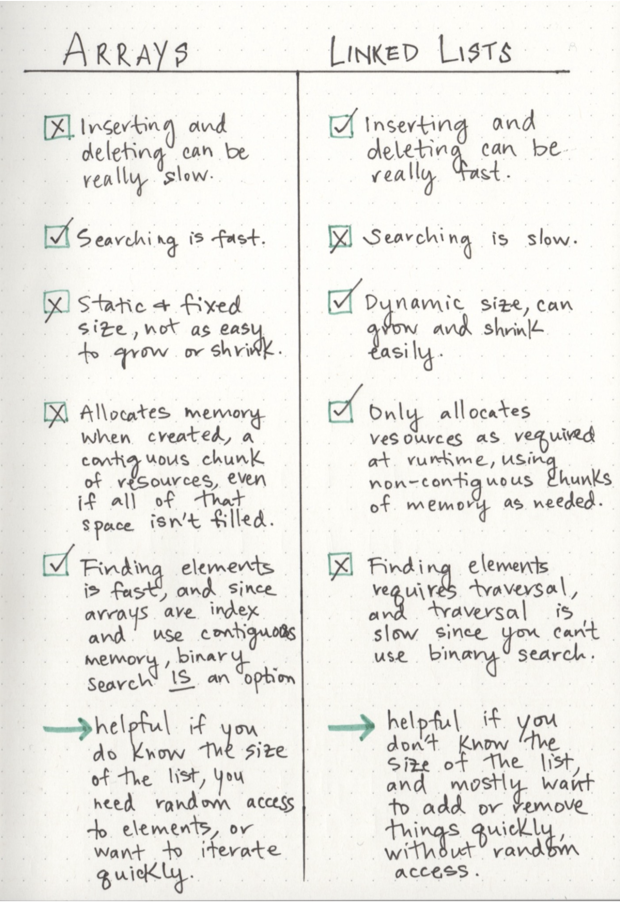

## Linked List
[link](https://medium.com/basecs/whats-a-linked-list-anyway-part-1-d8b7e6508b9d)

**Good Rule of Thumb**
- efficient when adding & removing most elements, but can be extrememly slow to search and find a single element

Linked lists are a linear data structure (sequence and an order to how they are constucted and traversed).

- linear structures is where items don't have to be arranged in order and the data structure can be traversed non-sequentially

Types of Linked Lists
1. Singly linked lists - based soley on the fact that they only go in one direction

2. Doubly linked lists - to hop between one node and the node previous without having to go back to the very beginning of the list

## Linked List Articles
[Overview](https://codefellows.github.io/common_curriculum/data_structures_and_algorithms/Code_401/class-05/resources/singly_linked_list.html)

[With Illustrations](https://codefellows.github.io/common_curriculum/data_structures_and_algorithms/Code_401/class-05/resources/singly_linked_list.html)

[With Illustrations - Part 2](https://medium.com/basecs/whats-a-linked-list-anyway-part-2-131d96f71996)