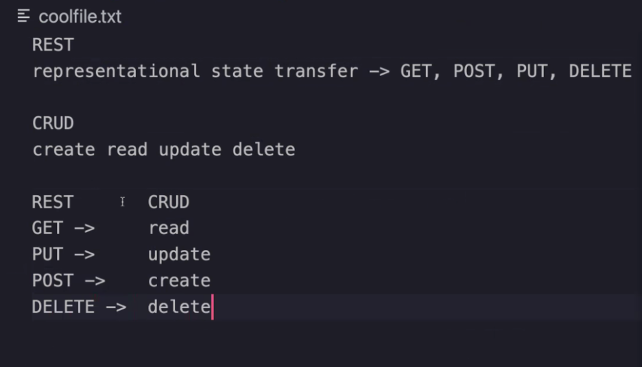

# Authentication

**1. Explain what a “Singleton” is (in Computer Science terms)**
a software design pattern that restricts the instantiation of a class to one "single" instance. It is 1 of 23 well-known "Gang of Four" design patterns that describe how to solve recurring design problems to design flexible and reusable object-oriented software, that is, objects that are easier to implement, change, test, and reuse.
[Ref](https://en.wikipedia.org/wiki/Singleton_pattern)

**1. Explain how the Singleton pattern can be used with Node modules, specifically with classes**
Singleton creates a single instance of an object, which is useful because  the creation of multiple ones causes problems

**1. If you were tasked with building a middleware system like Express uses, what approach might you take to construct/operate it?**
I would first determine what type of data would be stored and what its use would be for and then determine what sort of middleware libraries to use for those purposes.

# Vocabulary
**Router Middleware**
chainable middleware that uses ```req.params``` and ```req.query``` whose main methods are ```.get```, ```.post```,```.use```, and ```.fileserver(yourFileServer)```.
**Dynamic Module Loading**
mechanism by which a computer program can, at run time, load a library (or other binary) into memory, retrieve the addresses of functions and variables contained in the library, execute those functions or access those variables, and unload the library from memory.
[Ref](https://en.wikipedia.org/wiki/Dynamic_loading#:~:text=Dynamic%20loading%20is%20a%20mechanism,unload%20the%20library%20from%20memory.)

**Singleton Pattern**
a software design pattern that restricts the instantiation of a class to one "single" instance. This is useful when exactly one object is needed to coordinate actions across the system.

**CRUD -> REST Method Matches**


**Mock Testing**
an approach to unit testing that lets you make assertions about how the code under test is interacting with other system modules. In mock testing, the dependencies are replaced with objects that simulate the behaviour of the real ones.
[Ref](https://devopedia.org/mock-testing#:~:text=Mock%20testing%20is%20an%20approach,behaviour%20of%20the%20real%20ones.)

# Preview

1. Which 3 things had you heard about previously and now have better clarity on?
- Server side authentication protocol
- Client side authentication protocol
- BA implementation

1. Which 3 things are you hoping to learn more about in the upcoming lecture/demo?
- Timing Attacks
- Hask Collision Attacks
- node.bycrypt.js
BCrypt
1. What are you most excited about trying to implement or see how it works?
- node.bcryt.js

- 
## Referenced Articles
[bycrypt docs](https://www.npmjs.com/package/bcrypt)
[basic Auth](https://en.wikipedia.org/wiki/Basic_access_authentication)
[OSWASP Auth Cheatsheet](https://cheatsheetseries.owasp.org/cheatsheets/Authentication_Cheat_Sheet.html)
[Securing Passwords](https://thehackernews.com/2014/04/securing-passwords-with-bcrypt-hashing.html)