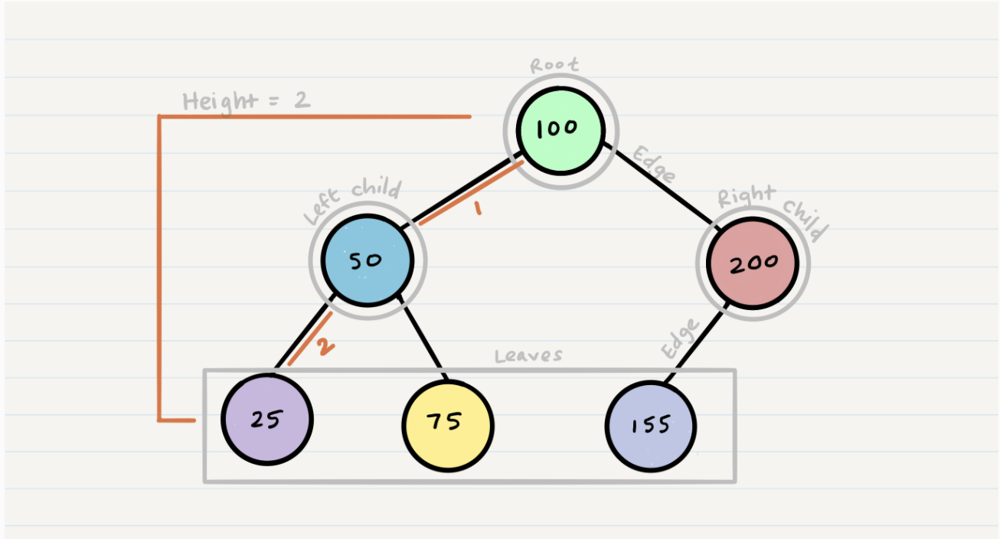
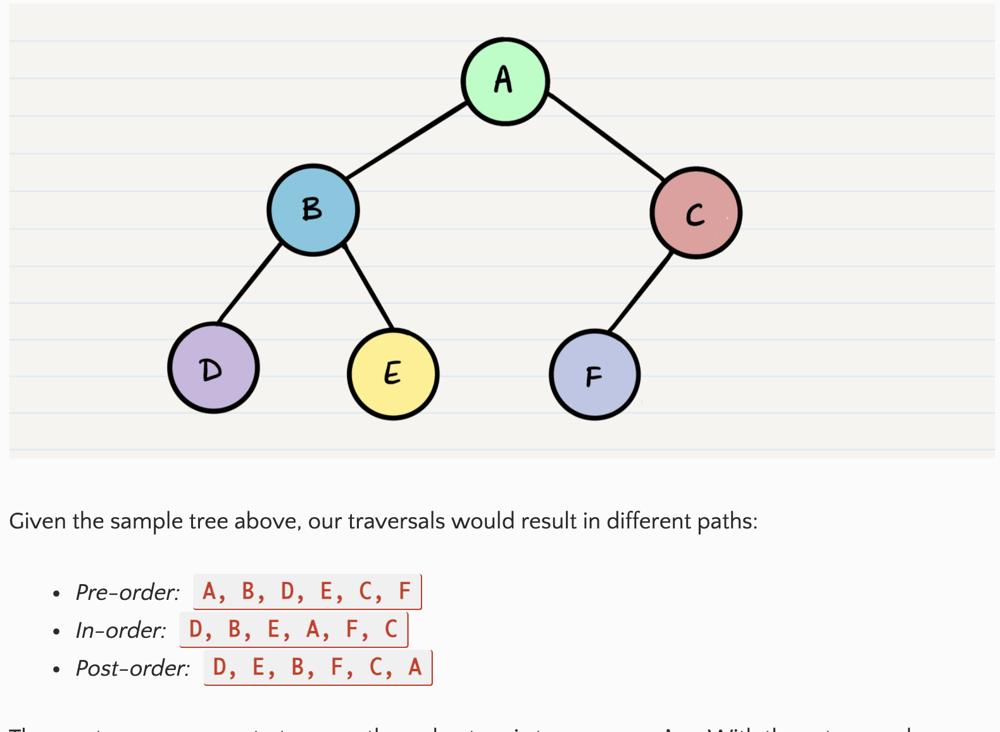
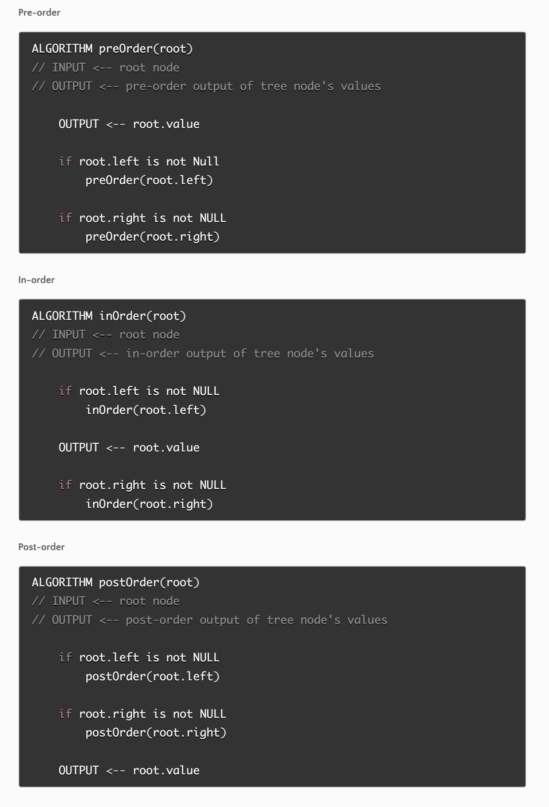
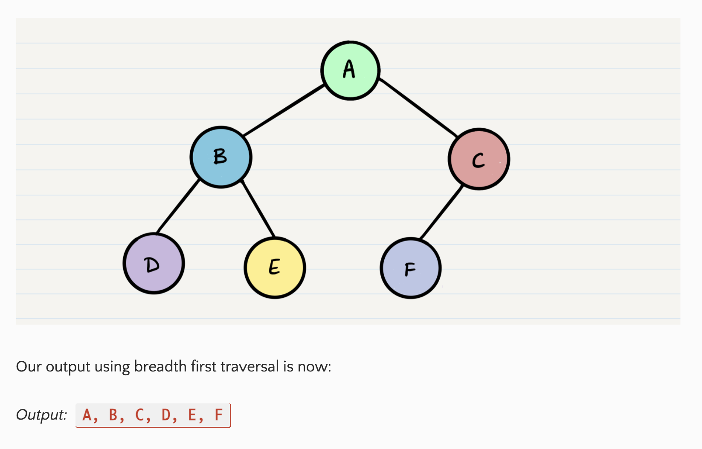
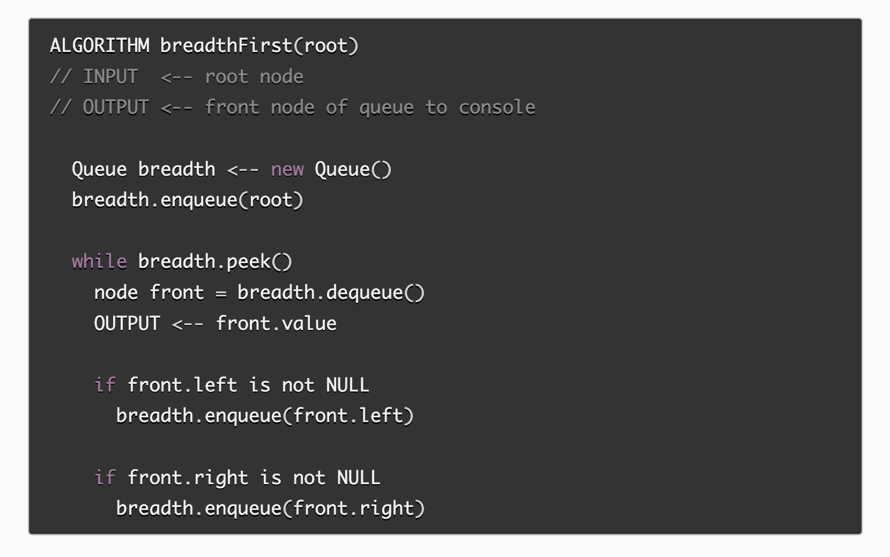
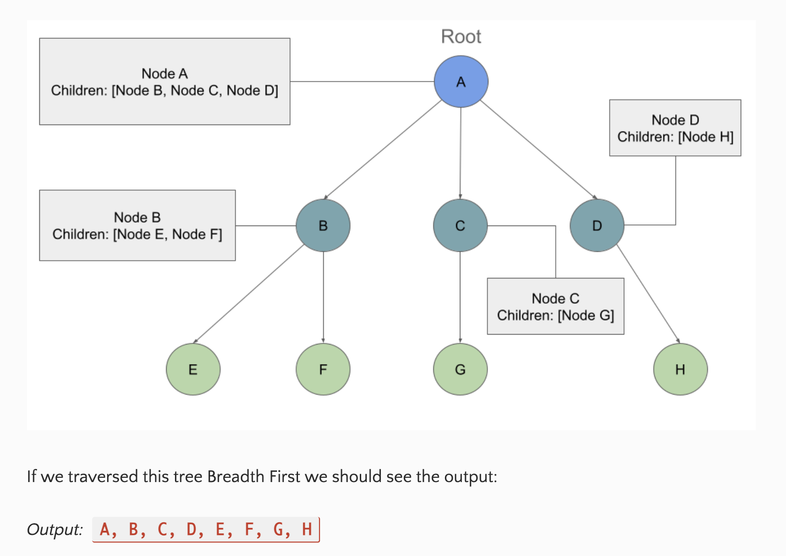
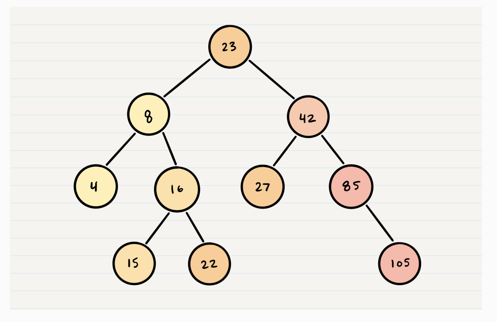

# Trees

**Different Types:** Binary, Binary Search, & K-Ary

## Vocab
- **Node:** A Tree node is a component which may contain it’s own values, and references to other nodes
- **Root:** The root is the node at the beginning of the tree
- **K:** A number that specifies the maximum number of children any node may have in a k-ary tree. In a binary tree, k = 2.
- **Left:** A reference to one child node, in a binary tree
- **Right:** A reference to the other child node, in a binary tree
- **Edge:** The edge in a tree is the link between a parent and child node
- **Leaf:** A leaf is a node that does not have any children
- **Height:** The height of a tree is the number of edges from the root to the furthest leaf

## Binary Tree

**2 Types of Traversals:** Depth First & Breadth First

**Depth First**
 prioritize going through the depth (height) of the tree first

 **3 Methods For Depth First Traversal:**
 - Pre-Order: value, left, right
 - In-Order: left, value, right
 - Post-Order: left, right, value

**Recursion:** 
- most comon way to traverse through a tree
- rely on call stack to navigate back up the tree when we've reached the end of a sub-path

**Pre-Order:** 
- root has to be looked at first

**Pseudocode For All 3 Depth First Tree Traversals**
- Biggest difference between the 3: when the root node is being looked at

**Breadth First**
iterates through the tree by going through each level of the tree node-by-node

- first traversal uses a queue(instead of a call stack via recursion)

**Pseudocode**

## K-Ary Trees

- trees where nodes have more than 2 children
- traversals push nodes into a queue

**Adding Nodes to Binary Trees**
- fill all child spots from the top down using breadth first traversal
- filled spots from left to right

**Big O**
- inserting a new node: O(n)
- searching for a new node: O(n)
- node insertion using breadth first: O(w)

**"Perfect Binary Tree:**
where every non-leaf node has exactly 2 children

## Binary Search Trees
- a type of tree that does have some structure attached to it(sorted)
- nodes are organized in a manner where all values that are smaller than the root are placed to the left, and all values that are larger than the root are placed to the right

**Big O**
- time complexity of searching: O(h) or O(height)
- in a perfect tree: height is log(n)
- space complexity: 0(1)

[Ref](https://codefellows.github.io/common_curriculum/data_structures_and_algorithms/Code_401/class-15/resources/Trees.html)

